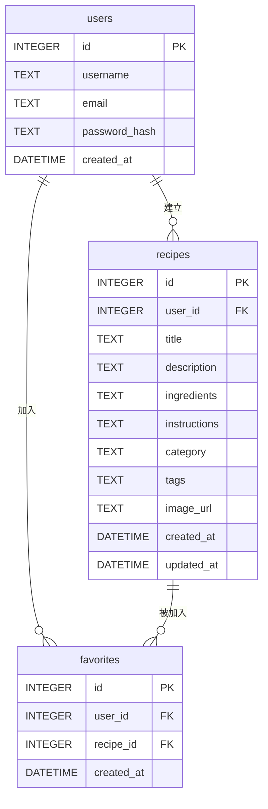

# DB Design - 食譜收藏夾系統

## 1. ER 圖（實體關係圖）

本系統主要由使用者、食譜、我的最愛三張表組成：

## 2. 資料表詳細說明

### 2.1 users (使用者資料表)
設計用來儲存使用者的基本資訊與登入憑證：
- `id` (INTEGER): 主鍵，自動遞增。
- `username` (TEXT): 使用者名稱，必填。
- `email` (TEXT): 電子郵件信箱，必填且唯一，將作為登入時的帳號使用。
- `password_hash` (TEXT): 密碼，經由安全性雜湊處理後儲存，必填。
- `created_at` (DATETIME): 帳號建立時間，預設為當前資料庫時間。

### 2.2 recipes (食譜資料表)
儲存每份食譜的詳細內容與建立此食譜的使用者關聯：
- `id` (INTEGER): 主鍵，自動遞增。
- `user_id` (INTEGER): 外鍵，對應 `users.id`，標示這份食譜的擁有者。刪除使用者時應級聯刪除(CASCADE)。
- `title` (TEXT): 食譜標題（如：紅燒肉），必填。
- `description` (TEXT): 食譜簡介。
- `ingredients` (TEXT): 食材清單（為求 MVP 快速開發，可存成純文字或 JSON 格式）。
- `instructions` (TEXT): 料理步驟、作法。
- `category` (TEXT): 簡易主分類（如：中式、西式）。
- `tags` (TEXT): 食譜標籤（如：減脂, 快炒），可透過逗號分隔字串達成簡易搜尋。
- `image_url` (TEXT): 食譜圖片的位址或自定義路徑。
- `created_at` (DATETIME): 建立時間。
- `updated_at` (DATETIME): 最後編輯/更新時間。

### 2.3 favorites (我的最愛清單)
作為中介表，記錄特定的使用者將哪些特定的食譜加入了我的最愛集合 (多對多關聯)：
- `id` (INTEGER): 主鍵，自動遞增。
- `user_id` (INTEGER): 外鍵，對應 `users.id`。
- `recipe_id` (INTEGER): 外鍵，對應 `recipes.id`。
- `created_at` (DATETIME): 加入最愛的時間點。
- （約束）：`user_id` 與 `recipe_id` 為 UNIQUE 組合，防止重複加入同一份食譜。

## 3. SQL 建表語法
完整的 `CREATE TABLE` 語法已獨立儲存於 `database/schema.sql`，可利用 Python 直接執行初始化。

## 4. Python Model 程式碼
根據架構文件的決策，為避免龐大的 ORM 學習與引入成本，已直接採用原生 `sqlite3` 庫並且封裝成物件導向方法。
各別的 Model 建置於：
- `app/models/db.py`：管理共用的連線及資料庫初始化。
- `app/models/user.py`：處理建立用戶與登入帳號檢索。
- `app/models/recipe.py`：負責建立、查詢、更新與刪除核心食譜。
- `app/models/favorite.py`：負責切換加入/移除最愛狀態與抓取清單。
