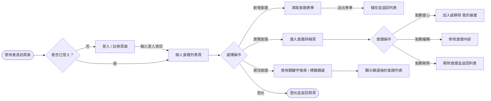
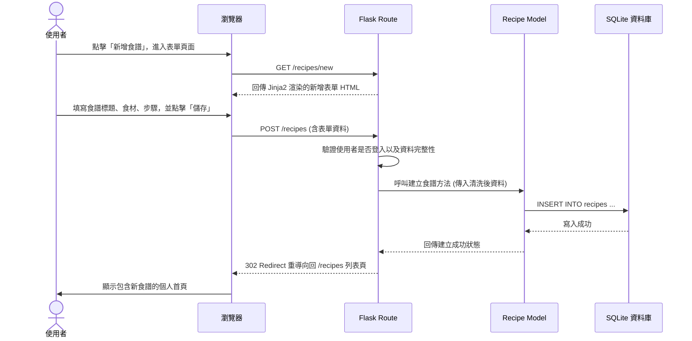

# Flowchart - 食譜收藏夾系統

本文件視覺化了本系統的使用者操作流程，以及資料與後端伺服器的互動細節。包含「使用者流程圖」、「系統序列圖」及「功能路由對照表」三個部分。

## 1. 使用者流程圖（User Flow）

呈現使用者進入網站後，可以進行的各種操作路徑：

## 2. 系統序列圖（Sequence Diagram）

以下描述「新增一筆食譜」從客戶端填寫送出，到後端儲存至資料庫的完整技術流程：

## 3. 功能清單與路由對照表

系統主要功能都會對應到特定的 URL 與 HTTP 方法：

| 功能名稱 | 對應路徑 (URL) | HTTP 方法 | 說明 |
|---|---|---|---|
| 首頁 (訪客) | `/` | GET | 網站介紹，引導未登入者前往註冊或登入 |
| 會員註冊 | `/register` | GET / POST | 顯示註冊表單，與接收使用者註冊資料 |
| 會員登入 | `/login` | GET / POST | 顯示登入表單，與接收使用者驗證資料 |
| 會員登出 | `/logout` | GET | 清除 Session 並登出 |
| 食譜列表 | `/recipes` | GET | 顯示目前登入使用者的所有食譜（可帶查詢字串如 `?q=關鍵字` 提供搜尋） |
| 新增食譜頁面 | `/recipes/new` | GET | 供使用者填寫的新增表單頁面 |
| 儲存新食譜 | `/recipes` | POST | 接收新增表單並寫入資料庫 |
| 食譜內容頁 | `/recipes/<id>` | GET | 查看某一個食譜的詳細資訊 |
| 編輯食譜頁面 | `/recipes/<id>/edit` | GET | 供使用者修改內容的表單頁面 |
| 更新食譜 | `/recipes/<id>` | POST | 將更新後的表單內容覆寫至資料庫 |
| 刪除食譜 | `/recipes/<id>/delete`| POST | 刪除指定的食譜並導向回列表 |
| 切換我的最愛 | `/recipes/<id>/favorite`| POST | 將指定食譜標記為喜歡或取消標記 |
